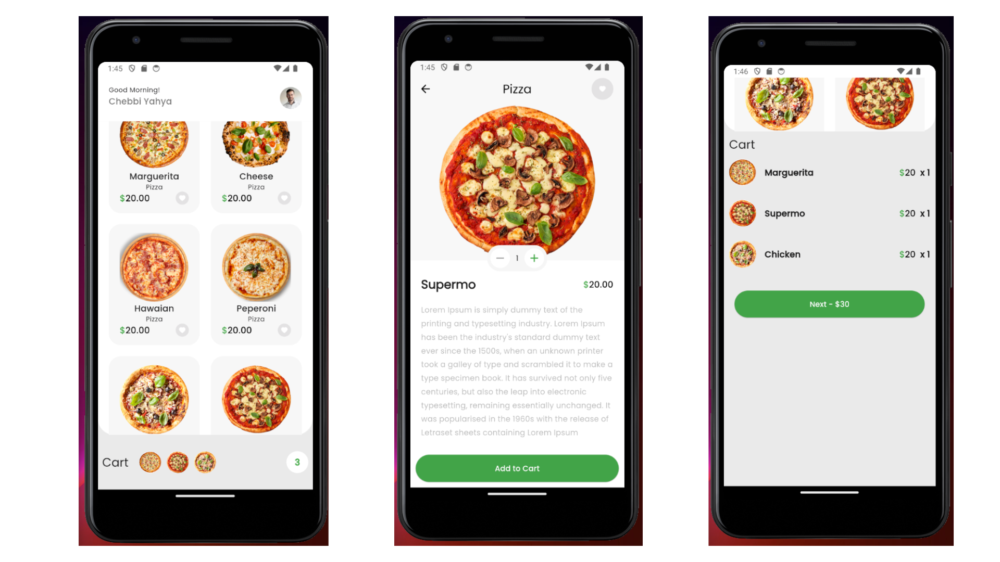
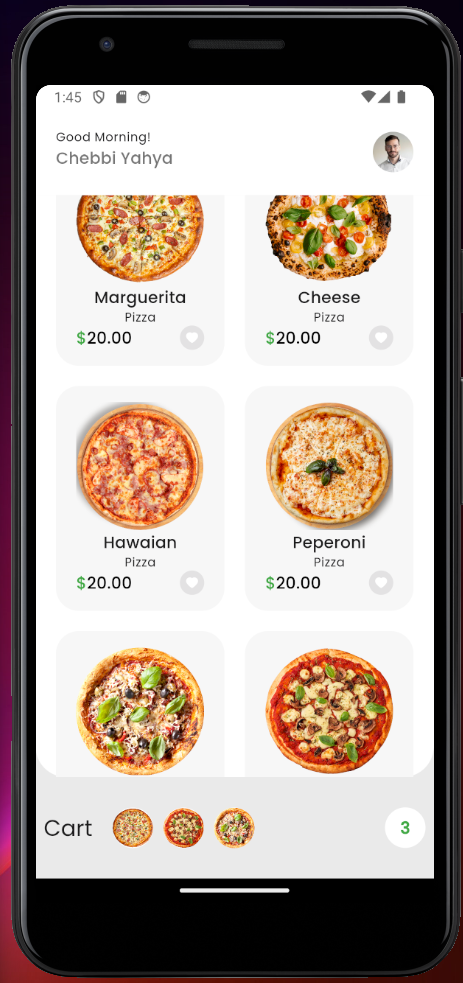
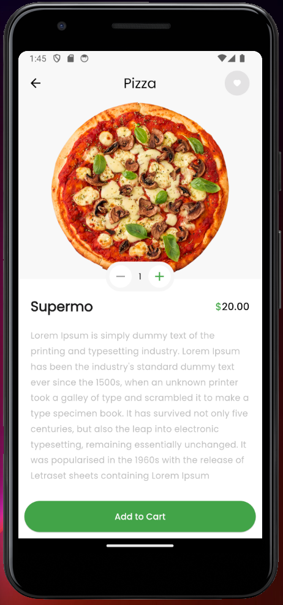
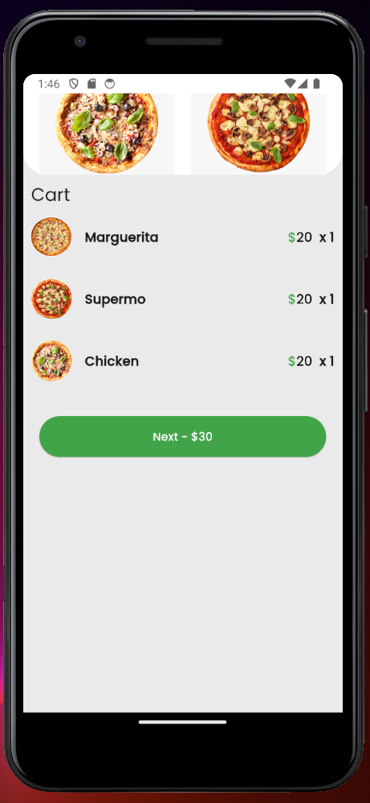

# Pizza App with Animations - Browse, Add to Cart, and View Cart



## Description

I developed a pizza ordering application to demonstrate my animation skills in Flutter. This project highlights:

- **Browse Pizzas**: A list of pizzas that users can scroll through, each with detailed descriptions.
- **Add to Cart**: Users can easily add pizzas to their cart with interactive animations.
- **View Cart**: A dynamic cart page displays the contents with smooth transitions and interactions.
- **Seamless Animations**: Engaging animations throughout the app for a fluid shopping experience.

This project showcases my expertise in building engaging, animated user interfaces that provide a smooth, enjoyable experience.

## Features

- **Smooth Animations**: Animations are integrated for transitions and user interactions.
- **Interactive Shopping Cart**: Users can add, remove, and view items in their cart seamlessly.
- **Detailed Pizza Descriptions**: Each pizza comes with a detailed view for better user interaction.
- **Responsive UI**: The app adjusts seamlessly to different screen sizes and resolutions.

## Screenshot





## Tech Stack

- **Flutter**: Dart-based cross-platform framework.
- **Widgets Used**:
  - `ListView.builder`
  - `AnimatedContainer`
  - `Hero`
  - `AnimatedSwitcher`

## How to Run

1. Clone the repository:
   ```bash
   git clone https://github.com/ChebbiYahya/Pizza-App-with-Animations.git

2. Navigate to the project directory
    ```bash
    cd pizza-app

3. Install dependencies:
    ```bash
    flutter pub get

4. Run the app:
    ```bash
    flutter run